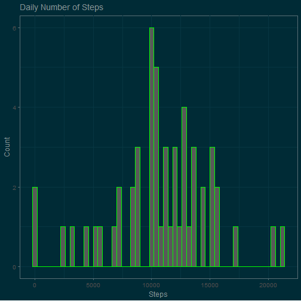
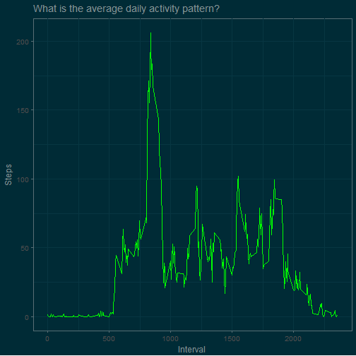
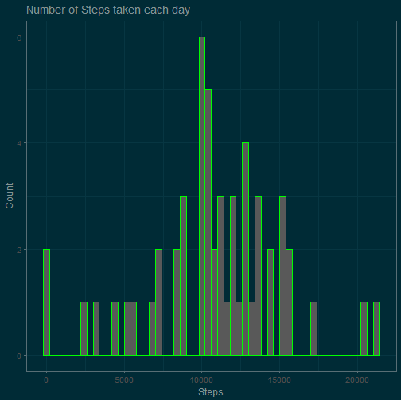
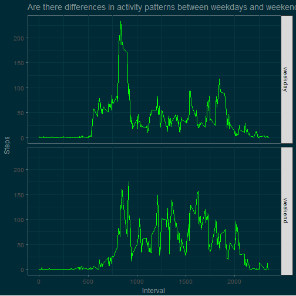

# R Markdown

This is an assignment for the second week of the course Reproducible Research. 

## Loading and preprocessing the data

Loading libraries


```r
library('ggplot2')
library("ggthemes")
```


1. Load and understand the data .


```r
 act <- read.csv('activity.csv')
 head(act)
```

```
##   steps       date interval
## 1    NA 2012-10-01        0
## 2    NA 2012-10-01        5
## 3    NA 2012-10-01       10
## 4    NA 2012-10-01       15
## 5    NA 2012-10-01       20
## 6    NA 2012-10-01       25
```

```r
 str(act)
```

```
## 'data.frame':	17568 obs. of  3 variables:
##  $ steps   : int  NA NA NA NA NA NA NA NA NA NA ...
##  $ date    : Factor w/ 61 levels "2012-10-01","2012-10-02",..: 1 1 1 1 1 1 1 1 1 1 ...
##  $ interval: int  0 5 10 15 20 25 30 35 40 45 ...
```

2. Process/transform the data (if necessary) into a format suitable for your analysis


```r
act$date <- as.Date(act$date)
```


## What is mean total number of steps taken per day?
1. Calculate the total number of steps taken per day.
2. If you do not understand the difference between a histogram and a barplot, research the difference between them. Make a histogram of the total number of steps taken each day.

```r
sumstp <- aggregate(steps ~ date, act, sum)
 g <- ggplot(sumstp, aes(steps))
 g + geom_histogram(binwidth = 400, col="green") + 
	theme_solarized(light = F) + 
	ggtitle("Daily Number of Steps") + 
	xlab("Steps") + 
	ylab("Count")
```



3. Calculate and report the mean and median of the total number of steps taken per day.

```r
 mean.steps <- mean(sumstp$steps) 
 median.steps <- median(sumstp$steps)
 mean.steps
```

```
## [1] 10766.19
```

```r
 median.steps
```

```
## [1] 10765
```


##What is the average daily activity pattern?
1.Make a time series plot (i.e. type = "l") of the 5-minute interval (x-axis) and the average number of steps taken, averaged across all days (y-axis).

```r
meanstp <- aggregate(steps ~ interval, act, mean)
g <- ggplot(meanstp, aes(interval, steps))
g + geom_line(col="green") + 
	theme_solarized(light = F) + 
	ggtitle("What is the average daily activity pattern?") + 
	xlab("Interval") + 
	ylab("Steps")
```



2.Which 5-minute interval, on average across all the days in the dataset, contains the maximum number of steps?
meanstp$interval[which.max(meanstp$steps)] 

```r
meanstp$interval[which.max(meanstp$steps)] 
```

```
## [1] 835
```


##Imputing missing values
Note that there are a number of days/intervals where there are missing values (coded as NA). The presence of missing days may introduce bias into some calculations or summaries of the data.
1.Calculate and report the total number of missing values in the dataset (i.e. the total number of rows with NAs)

```r
sum(is.na(act$steps))
```

```
## [1] 2304
```
2.Devise a strategy for filling in all of the missing values in the dataset. The strategy does not need to be sophisticated. For example, you could use the mean/median for that day, or the mean for that 5-minute interval, etc.

```r
x <- act[is.na(act$steps)==T,]
x$steps <- meanstp$steps[x$interval == meanstp$interval]
```

3.Create a new dataset that is equal to the original dataset but with the missing data filled in.

```r
act2 <- rbind(x, act[is.na(act$steps)==F,])
nrow(act2)
```

```
## [1] 17568
```

4.Make a histogram of the total number of steps taken each day and Calculate and report the mean and median total number of steps taken per day. Do these values differ from the estimates from the first part of the assignment? What is the impact of imputing missing data on the estimates of the total daily number of steps?

```r
sumstp2 <- aggregate(steps ~ date, act2, sum)
g <- ggplot(sumstp2, aes(steps))
g + geom_histogram(binwidth = 400, col="green") + 
	theme_solarized(light = F) + 
	ggtitle("Number of Steps taken each day") + 
	xlab("Steps") + 
	ylab("Count")
```



```r
mean.steps2 <- mean(sumstp2$steps) 
median.steps2 <- median(sumstp2$steps)
```
The mean difference is 0 because I've replaced the NA's by the mean of each interval.

```r
mean.steps2 - mean.steps
```

```
## [1] 0
```
The median difference is very low 0.59.

```r
median.steps2 - median.steps
```

```
## [1] 0.5943396
```


##Are there differences in activity patterns between weekdays and weekends?
1.Create a new factor variable in the dataset with two levels - "weekday" and "weekend" indicating whether a given date is a weekday or weekend day.

```r
Sys.setlocale("LC_TIME", "English")
```

```
## [1] "English_United States.1252"
```

```r
act2$weekend <- ifelse(weekdays(act2$date) == "Saturday" | weekdays(act2$date) == "Sunday" ,"weekend","weekday")
```
2.Make a panel plot containing a time series plot (i.e. type = "l") of the 5-minute interval (x-axis) and the average number of steps taken, averaged across all weekday days or weekend days (y-axis). See the README file in the GitHub repository to see an example of what this plot should look like using simulated data.

```r
meanw <- aggregate(steps ~ weekend + interval, act2, mean)
g <- ggplot(meanw, aes(interval, steps))
g + geom_line(col="green") + 
      facet_grid(weekend ~.) + 
      theme_solarized(light = F) + 
      ggtitle("Are there differences in activity patterns between weekdays and weekends?") + 
      xlab("Interval") + 
      ylab("Steps")
```


